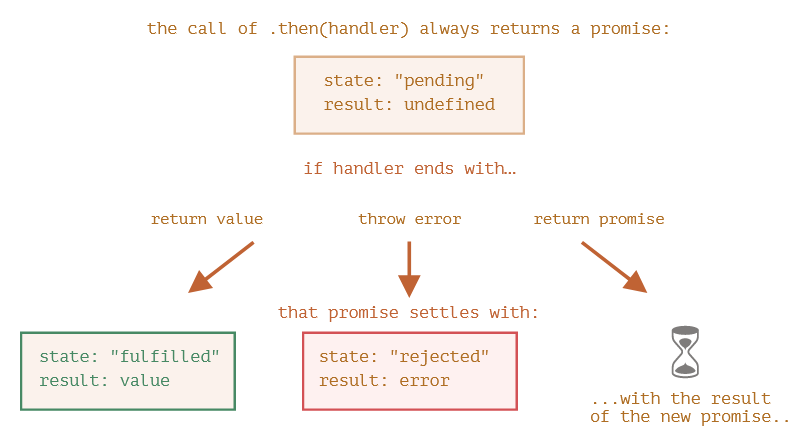
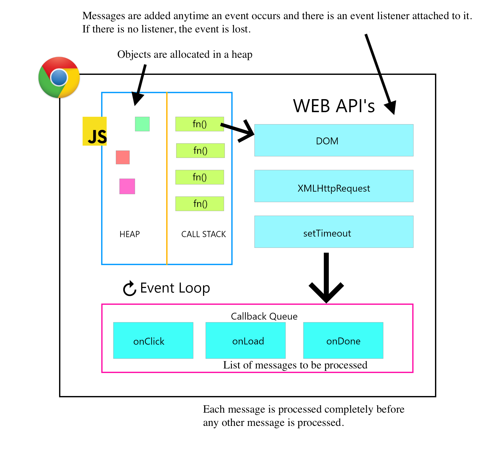

## Async-Await

Empecemos hablando de la palabra async, esta puede ponerse antes de una función, esto significa que la función siempre devuelve una promesa, por ello podemos comprobar que esto es lo mismo:
```js
async function f() {
  return 1;
}

f().then(alert); // 1
---------------------
async function f() {
  return Promise.resolve(1);
}

f().then(alert); // 1
```
Bastante simple esta parte, pero ahora hay otra palabra clave _await_ que funciona dentro de _async_. La palabra clave _await_ hace que JavaScript espere hasta que esa promesa se establezca y devuelva su resultado. A continuación, se muestra un ejemplo de una promesa que se resuelve en 1 segundo:
```js
async function f() {

  let promise = new Promise((resolve, reject) => {
    setTimeout(() => resolve("done!"), 1000)
  });

  let result = await promise; // wait until the promise resolves (*)

  alert(result); // "done!"
}

f();
```
En este caso, la ejecución de la función se pausa en la línea (*) y retoma cuando las promesas se establecen. Para entrar un poco más en detalle de la funcionalidad de _await_, básicamente lo que hace es suspender la ejecución de la función hasta que la promesa se establece. Mencionar que si se intenta usar _await_ en funciones no asíncronas tendremos un error de sintaxis.

Otra cosa importante es que _await_ no funciona en la parte superior del código. Pero para solucionarlo se puede crear una función anónima asíncrona y así todo funciona correctamente.

Importante destacar que si .then devuelve una promesa, el resto de las que se encuentran en cadena esperan a que esta se resuelve, y dependiendo lo que se obtiene se sigue o lanza error. Esto se ve mejor en la siguiente imagen:



## Ejercicio 1

```js
setTimeout(function () {
    console.log('macrotask 1');
}, 0);

Promise.resolve().then(function () {
    console.log('microtask 1');
    setTimeout(function () {
        console.log('macrotask 2');
        Promise.resolve().then(
            () => console.log('Nested microtask 3')
        )
    }, 0);
}).then(function () {
    console.log('microtask 2');
});
```
Antes de nada, hay que tener en cuenta que hay dos colas, una para las callbacks y otra para los manejadores de promesas, ...  vamos a añadir una imagen que es muy clara para ver como funcionan las colas y las callbacks:



Ahora con esto ya establecido, pasamos con el código. Lo primero que se va a ejecutar es:
```js
setTimeout(function () {
    console.log('macrotask 1');
}, 0);
```

**... Complete la explicación ...**

Ahora se comprueban los elementos de la cola y se extrae el último quedando las dos colas vacías y, obteniendo así los dos últimos console.log() -> **Nested microtask 3**, teniendo la salida final:
```bash
gitpod /workspace/async-await-aluXXXXXXX $ node src/excercise1.js 
microtask 1
microtask 2
macrotask 1
macrotask 2
Nested microtask 3
```

## Ejercicio 2

```js
for (let i = 0; i < 2; i++) {
	setTimeout(() => {
		console.log("Timeout ", i);
		Promise.resolve().then(() => {
			console.log("Promise 1 ", i);
		}).then(() => {
			console.log("Promise 2 ", i);
		});
	})
}
```
En este caso nos encontramos con un bucle,que va a realizar dos iteraciones variando el valor de i en 0 y 1. Empezando en la iteración 0 se lanza un setTimeOut, que hace que la callback generada después de 0 segundos pase a la cola, teniendo lo siguiente:

**... complete la explicación ...**


## Fetch using async/await

Partiendo del siguiente código:
```js
function loadJson(url) {
  return fetch(url)
    .then(response => {
      if (response.status == 200) {
        return response.json();
      } else {
        throw new Error(response.status);
      }
    });
}

loadJson('no-such-user.json').catch(console.log); // Error: 404
```
Lo que se persigue es reescribirlo usando async/await, con ello debemos definir que la funcion *loadJson* sea async. Para luego cambiar su contenido de forma que le asignemos el valor del fetch a una variable (poniendo el await) y hacerlo igual con el caso de responde.json, así obtenemos:

```js
  ...
```

## Simplify Complex Example

```js
class HttpError extends Error {
  constructor(response) {
    super(`${response.status} for ${response.url}`);
    this.name = 'HttpError';
    this.response = response;
  }
}

function loadJson(url) {
  return fetch(url)
    .then(response => {
      if (response.status == 200) {
        return response.json();
      } else {
        throw new HttpError(response);
      }
    });
}

// Ask for a user name until github returns a valid user
function demoGithubUser() {
  let name = prompt("Enter a name?", "iliakan");

  return loadJson(`https://api.github.com/users/${name}`)
    .then(user => {
      alert(`Full name: ${user.name}.`);
      return user;
    })
    .catch(err => {
      if (err instanceof HttpError && err.response.status == 404) {
        alert("No such user, please reenter.");
        return demoGithubUser();
      } else {
        throw err;
      }
    });
}

demoGithubUser();
```

Para este apartado, hay que reescribir este código utilizando async/await. Por ello, la función *loadJson* ya la tenemos modificada del ejercicio anterior. Por otro lado, tenemos la función *demoGithubUser*. Para empezar tenemos que hacer la función asíncrona, para ello usamos la palabra clave *async*. Con esto ya hecho, pasamos al contenido de la función. Antes que nada, hay que darse cuenta que hay recursividad, para resolver esto se ha creado una variable booleana que va a actuar como finalización del bucle, de tal forma que si ha encontrado el usuario que se buscaba se ponga a false y así salga del bucle.

Empezamos asignando a una variable user lo que se devuelve en *loadJson*, para ello debemos utilizar la palabra clave *await*. Luego pasamos a cambiar la estructura de then y catch por un try/catch. Para acabar, mostramos un alert con el nombre del usuario y devolvemos la variable ya creada. Mencionar que esta variable se crea por fuera del bucle para que no se esté creando en el bucle, sino que solo se asigne. Por ello, logramos lo siguiente:

```js
async function demoGithubUser() {
   // ...
}
```

## Async Call

```js
async function wait() {
  await new Promise(resolve => setTimeout(resolve, 1000));

  return 10;
}

function f() {
  // ...what should you write here?
  // we need to call async wait() and wait to get 10
  // remember, we can't use "await"
}
```

Para este ejercicio hay que hacer al menos dos formas de que se llame a  wait. 

...